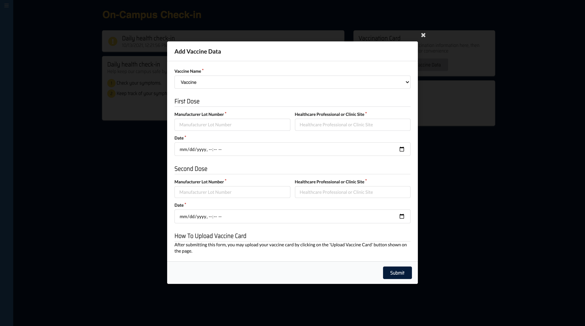
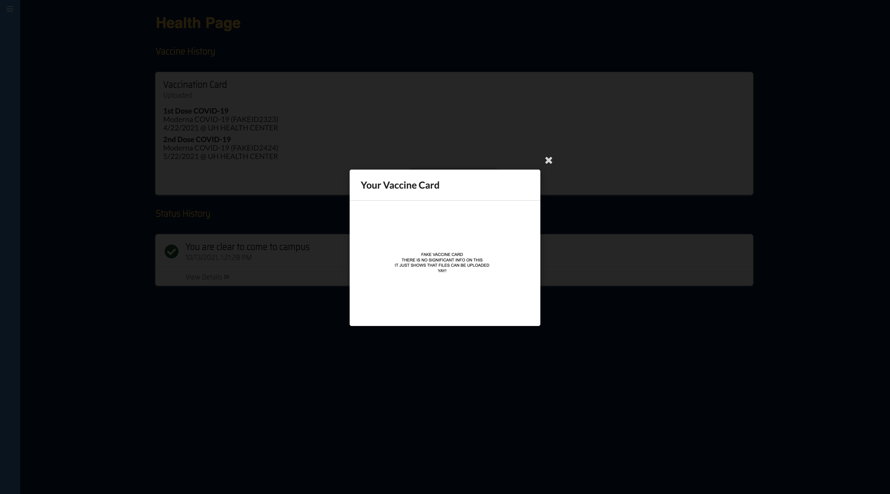

# Table of Contents
* [Lumi-Camino](#featured-project-lumi-camino)
* [The Team](#the-team-haccamino)

# Featured Project: Lumi-Camino
## Overview
Lumisight is a web application designed to help individuals track daily COVID symptoms and vaccination status. 

See our deployed website here: <a href="https://lumi-camino.meteorapp.com/#/" target="_blank">Lumi-Camino</a>

See our project here: <a href="https://github.com/HACC-Camino/HACC-Camino" target="_blank">Project Repository</a>

# Screenshots
Presented below is a walkthrough of the pages of our application. 

## Landing Page
Upon entering the site, the user is greeted by the landing page. The landing page provides users the option to sign up or sign in. 

## Sign Up
New users can fill out the necessary fields to create an account. 

## Sign In
Returning users can log in via the Sign In button on the landing page. 

## Home Page
Upon logging in, the user is taken to their home page. The page includes a daily status section, daily health check-in form, add vaccination data form, and resources if users want to know about COVID-19 testing or COVID guidance information. The daily status section displays a message about whether the user should or should not go to campus. This message is determined by the user's response to the daily health check-in form. 

## Daily Check In 
Users should fill out the Daily check-in form before going onto campus. The form checks if users test positive for COVID-19, have COVID symptoms, or have recently been exposed to COVID-19. If the user has any of these concerns, then they cannot go to campus.

## Add Vaccination Data
If the user has taken both of their vaccine shots, they can add their vaccination card to Lumi-Camino. The add vaccination form will ask for the vaccine name, manufacturer lot number, date, and site of the first and second dose. 

## Health Page
The health page contains the daily check-in history of the user and their vaccination data/card.

## View Uploaded Vaccine Card
After the user uploads their vaccination card, they can view it by selecting "View Vaccination Card" and the file will appear. 

## Sign Out
The sign-out button is located via the navbar and will ask the user for confirmation.

# The Team: HACCamino 

## Team Members
- [Anna Campainha](https://github.com/annacampainha)
- [Daphne Marie Estacio](https://github.com/dmtapia)
- [Jerome Gallego](https://github.com/alohajerome)
- [Michael Gainey](https://github.com/micgainey)
- [Timothy Huo](https://github.com/timothyhuo1)
