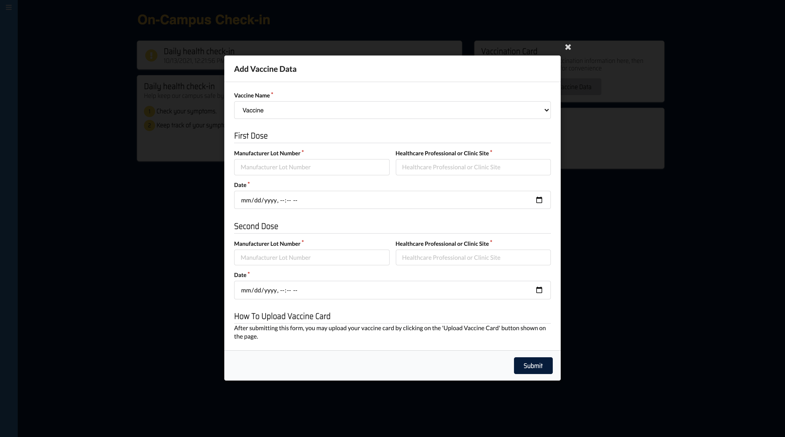
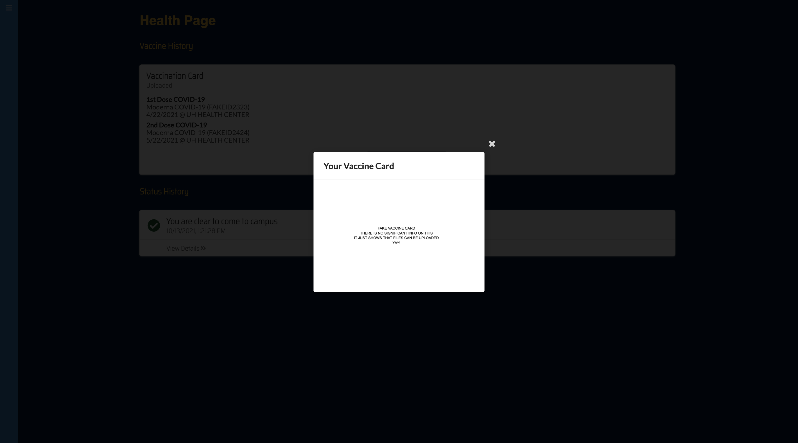

[Back to HACCamino](../index.md)
# Lumi-Camino
## Table of Contents
* [Overview](#overview)
* [Preview](#preview)
* [Milestones](#milestones)
* [The Team](#the-team-haccamino)

## Overview
Lumi-Camino is a web application designed to help individuals track daily COVID symptoms and vaccination status.

See our deployed website here: [Lumi-Camino](https://lumi-camino.meteorapp.com/#/)

See our project here: [Project Repository](https://github.com/HACC-Camino/HACC-Camino)

## Preview
Below are some screenshots of the web application using sample a user account and data.
### Landing Page
Upon entering the site, the user is greeted by the landing page. The landing page provides users the option to sign up or sign in.

### Sign Up
New users can fill out the necessary fields to create an account.

### Sign In
Returning users can log in via the Sign In button on the landing page.

### Home Page
Upon logging in, the user is taken to their home page. The page includes a daily status section, daily health check-in form, add vaccination data form, and resources if users want to know about COVID-19 testing or COVID guidance information. The daily status section displays a message about whether the user should or should not go to campus. This message is determined by the user's response to the daily health check-in form.

### Daily Check In
Users should fill out the Daily check-in form before going onto campus. The form checks if users test positive for COVID-19, have COVID symptoms, or have recently been exposed to COVID-19. If the user has any of these concerns, then they cannot go to campus.

### Add Vaccination Data
If the user has taken both of their vaccine shots, they can add their vaccination card to Lumi-Camino. The add vaccination form will ask for the vaccine name, manufacturer lot number, date, and site of the first and second dose.

### Upload Vaccine Card
After the user keys in their vaccine information, they have the option to upload their vaccine card.

### View Uploaded Vaccine Card
After the user uploads their vaccination card, they can view it by selecting "View Vaccination Card" and the file will appear.

### Health Page
The health page contains the daily check-in history of the user and their vaccination data/card.

### Sign Out
The sign-out button is located via the navbar and will ask the user for confirmation.
        

## Milestones
### Milestone 1
Project board: [M1](https://github.com/HACC-Camino/lumi-camino/projects/1)
* Focused on creating mock-up pages
* Implemented sign in, sign up, and sign out functionalities
* Created collections VaccinationCollection and HealthStatusCollection
* Implemented the following pages: [Landing Page](#landing-page) and [Home Page](#home-page), []
* Implemented [COVID Status of the Day](#daily-check-in) functionality
* Implemented a navigation bar

### Milestone 2
Project board: [M2](https://github.com/HACC-Camino/lumi-camino/projects/2)
* Implemented the following pages: [Health Page](#health-page) and Profile Page (NOTE: The team decided to remove the latter during Milestone 3)
* Implemented [Add Vaccination Data](#add-vaccination-data)

### Milestone 3
Project board: [M3](https://github.com/HACC-Camino/lumi-camino/projects/3)
* Implemented the following functionalities using AWS S3: [Upload Vaccine Card](#upload-vaccine-card) and [View Vaccine Card](#view-uploaded-vaccine-card)
* Added a 'Check In History' on Health Page
* Finalized the entire web application

# The Team: HACCamino
## Participating Members
- [Anna Campainha](https://github.com/annacampainha)
- [Daphne Marie Estacio](https://github.com/dmtapia)
- [Jerome Gallego](https://github.com/alohajerome)
- [Michael Gainey](https://github.com/micgainey)
- [Timothy Huo](https://github.com/timothyhuo1)

[Back to HACCamino](../index.md)